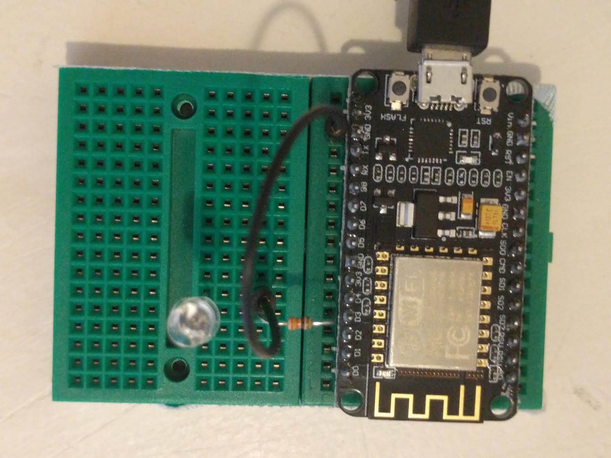

# burrow
Code for an ESP8266-based board equipped with an IR transmitter to control my AC unit.

## Prototype

### Parts List
- 1x ESP8266 ESP-12E WIFI Development Board
- 2x [Mini Breadboard](https://www.sparkfun.com/products/12046)
- 2x Short jumper cables
- 1x 330 ohm resistor
- 1x [IR diode](https://www.sparkfun.com/products/9469)
- 1x [4xAA Battery Pack w/ switch](https://www.sparkfun.com/products/12083)
- 8x [Disk Magnets](https://www.sparkfun.com/products/8890)
